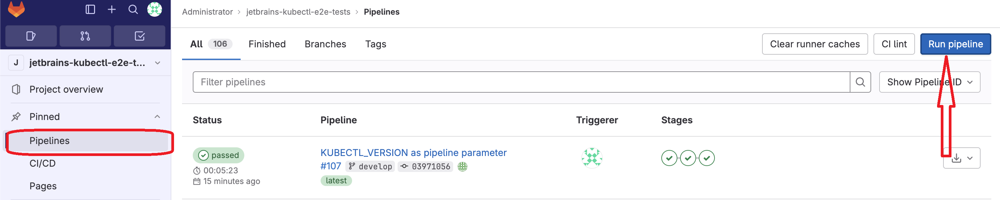
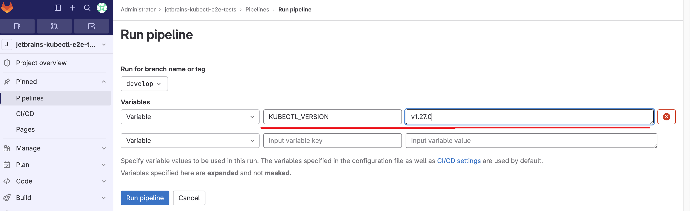
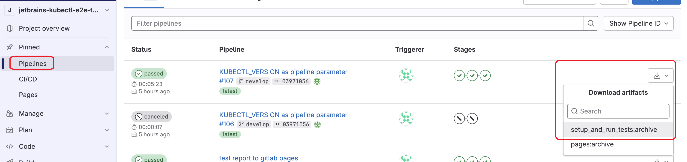
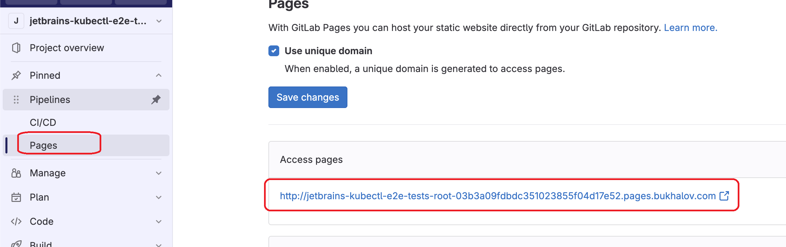

# jetbrains-kubectl-tests

This project tests the `kubectl` command-line tool and its functionality against a real Kubernetes cluster.

## Technologies Used

- [kind (Kubernetes in Docker)](https://kind.sigs.k8s.io) is used for easy instantiation of a Kubernetes cluster for testing.
    - Kind installation manual for different operating systems: [Installation Guide](https://kind.sigs.k8s.io/docs/user/quick-start/#installation)
    - Kind is lightweight, optimized for testing, and allows you to spin up and delete clusters quickly. It is the tool used for end-to-end Kubernetes tests in the [e2e-framework](https://github.com/kubernetes-sigs/e2e-framework).

The pipeline described in `.gitlab-ci.yml` follows these steps:
1. Installing `kind`, `kubectl` and `jre`
2. Creating a Kubernetes cluster using `kind`.
3. Executing different commands with `kubectl` and checking the outputs.

## Running in CI

You can start the pipeline from the pipelines page of GitLab by clicking the "Run pipeline" button:

The default `kubectl` version used is v1.28.3, but you can override it by passing the `KUBECTL_VERSION` variable when running the pipeline:

Test results can be downloaded as artifacts from GitLab's pipelines page

or can be viewed via this [link](http://jetbrains-kubectl-e2e-tests-root-03b3a09fdbdc351023855f04d17e52.pages.bukhalov.com).

## Running Locally

To run tests locally, you need to have the following tools installed:

- [JRE or JDK](https://www.oracle.com/java/technologies/downloads/)
- [Docker](https://docs.docker.com/engine/install/)
- [Kubectl](https://kubernetes.io/docs/tasks/tools/)
- [Kind](https://kind.sigs.k8s.io/docs/user/quick-start/)

You can use the provided scripts to install `kubectl`, `kind`, and spin up a cluster locally:

- For Mac OS or Linux (may require some changes depending on the distribution), use [local_install.sh](local_install.sh).
- For Windows, use [local_install.bat](local_install.bat).

Please note that you still need to install Docker and JRE yourself. You can also install the Kotest plugin for IntelliJ IDEA to work with tests from IDEA conveniently.

Pipeline run time can be optimized further by building a custom Docker image where `kind` and JRE are preinstalled.
Cluster creation should remain in the pipeline because it requires the Docker-in-Docker service (dind),
and `kubectl` installation should also be a part of the pipeline to allow parameterizing its version from GitLab when running with parameters.

There are a lot of hardcoded commands in tests some of which are repeatedly used, they could be extracted in a separate file,
for example object "KubectlCommands" with commands as string values or parametrized methods, but at this point with current quantity
of tests it seems like it would introduce more unnecessary complexity rather than help to structure code.